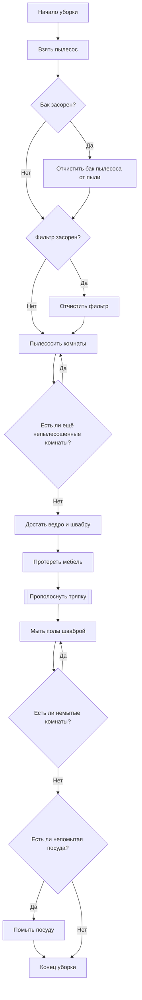
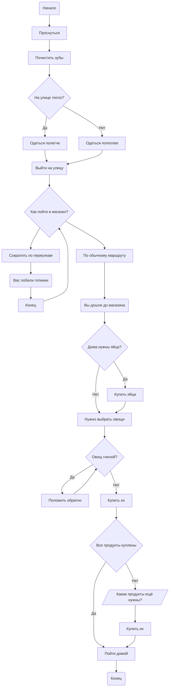
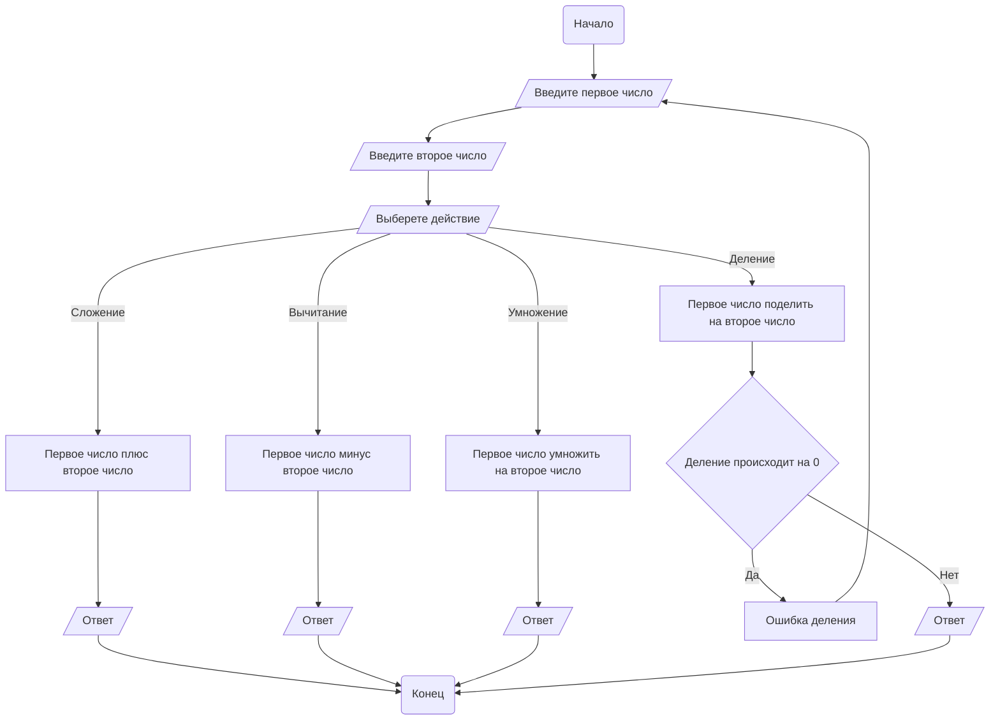
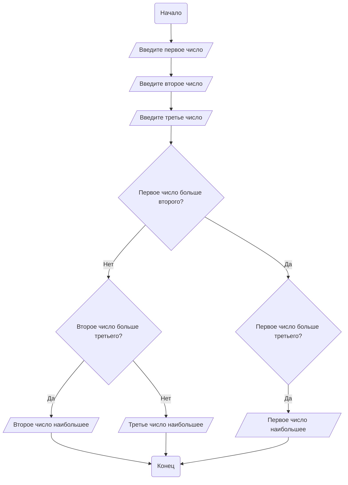

#### Задание 1.

Написать Блок-схему "Уборки в доме".

**Условия**: В блок схеме должно быть: 
- не меньше 10 процессов.
- не меньше 5 условий.
- не меньше 1 цикла

#### Задание 2.

Написать Блок-схему "Поход в магазин".

**Условия**: В блок схеме должно быть: 
- не меньше 10 процессов.
- не меньше 5 условий.
- не меньше 1 цикла.
- не меньше 1 блока данных.
-  не доделано!

#### Задание 3.

Написать Блок-схему "Калькулятор".

**Условия**: Калькулятор должен иметь следующие функции:
- Суммирование
- Вычитание
- Умножение
- Деление

*Примечание*: подумайте над тем, какие блоки можно использовать.

### Задания по вариантам

#### Вариант 2
Определить максимальное из трёх введенных чисел

*Пояснение*:  Алгоритм должен последовательно сравнивать числа между собой с помощью условий.

